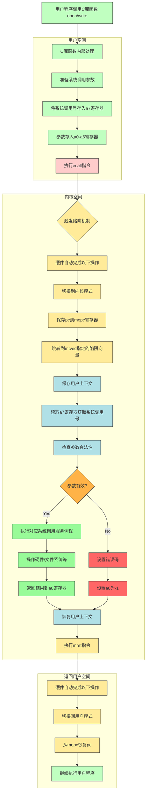

# Lecture 01. Introduction and Examples(Robert)

- [Lecture 01. Introduction and Examples(Robert)](#lecture-01-introduction-and-examplesrobert)
  - [1.1 课程内容简介](#11-课程内容简介)
  - [1.2 操作系统结构](#12-操作系统结构)
  - [1.3 WHY HARD/INTERESTING?](#13-why-hardinteresting)
  - [1.4 系统调用](#14-系统调用)
    - [1.4.1 read, write, exit 系统调用](#141-read-write-exit-系统调用)
      - [1. read 系统调用](#1-read-系统调用)
      - [2. write 系统调用](#2-write-系统调用)
      - [3. exit 系统调用](#3-exit-系统调用)
    - [1.4.2 open系统调用](#142-open系统调用)
      - [1.4.2.1. open 详解](#1421-open-详解)
      - [1.4.2.2. 文件描述符核心机制](#1422-文件描述符核心机制)
    - [1.4.3 shell](#143-shell)
      - [1.4.3.1. shell 执行 `ls` 原理](#1431-shell-执行-ls-原理)
      - [1.4.3.2. IO 重定向原理](#1432-io-重定向原理)
    - [1.4.4 fork -- 创建新进程](#144-fork----创建新进程)
      - [1.4.4.1 示例](#1441-示例)
      - [1.4.4.2 fork 的核心特性](#1442-fork-的核心特性)
      - [1.4.4.3 fork 的返回值](#1443-fork-的返回值)
      - [1.4.4.4 输出解释](#1444-输出解释)
      - [1.4.4.5 fork 与 Shell 的关系](#1445-fork-与-shell-的关系)
    - [1.4.5 exec、wait系统调用](#145-execwait系统调用)
      - [1.4.5.1 exec系统调用 —— **用新程序替换当前进程**](#1451-exec系统调用--用新程序替换当前进程)
      - [1.4.5.2 结合 fork/exec 系统调用 —— 父进程保留控制权](#1452-结合-forkexec-系统调用--父进程保留控制权)
      - [1.4.5.3  `wait` 系统调用 —— 等待子进程退出](#1453--wait-系统调用--等待子进程退出)
      - [1.4.5.4 `fork` + `exec` 调用子进程失败示例](#1454-fork--exec-调用子进程失败示例)
      - [1.4.5.5 扩展知识点：fork + exec 的性能问题与优化方向](#1455-扩展知识点fork--exec-的性能问题与优化方向)
      - [1.4.5.6 总结](#1456-总结)
    - [1.4.6 I/O Redirect](#146-io-redirect)
    - [1.4.7 附录：关键概念表](#147-附录关键概念表)

## 1.1 课程内容简介

> **课程目标**

- O/S DESIGN
- HANDS-ON EXP

> **O/S PURPOSE**

- `ABSTRACT H/W`抽象硬件
- `MULTIPLEX`:复用硬件
- `ISOLATION`:多个程序件互不干扰
- `SHARING`
- `SECURITY/PERMISSION SYSTEM/ACCESS CONTROL`
- `GOOD PERFORMANCE`
- `RANGE OF USER`

## 1.2 操作系统结构

重点内容：

- `Kernel`
- `Kernal`和用户空间（`USERSPACE`）程序间的接口
- `Kernel`内软件的架构

> **O/S ORAGNIZATION（操作系统结构）**

- `USERSPACE`:用户空间，运行各种各样的应用程序，如文本编辑器vi，C编译器(cc)
- `KERNAL`: **计算机资源守护者**。当启动计算机时，`Kernel`总是第一个被启动且只有一个。它维护数据管理每一个用户空间进程。`Kernel`同时还维护了大量的数据结构来实现管理各种各样的硬件资源，以供用户空间的程序使用。`Kernel`同时还有大量内置的服务。**`Kernel` 组成如下：**
  - `FS（文件系统）`:文件系统通常有一些逻辑分区。目前而言，文件系统的作用是**管理文件内容并找出文件在磁盘中的具体位置**。文件系统还维护了一个独立的命名空间，其中每个文件都有文件名，并且命名空间中有一个层级的目录，每个目录包含了一些文件。所有这些都被文件系统所管理。
  - `PROCESS（进程管理系统）`:每一个用户空间程序都被称为一个进程，它们有自己的内存，同时会共享的CPU时间。
  - `MEM,ALLCO（内存分配管理）`:不同的进程需要不同数量的内存，Kernel会复用内存、划分内存，并为所有的进程分配内存。    - `ACCESS CTL（读取控制）`:当一个进程想要使用某些资源时，如读取磁盘中的数据，使用某些内存，`Kernel`中的`Access Control`会决定是否允许这样的操作。
- 硬件底层资源：CPU、RAM、DISK、NET


> **API-KERNAL**

应用程序通过**系统调用（`System Call`）** 来访问`Kernel`。系统调用与程序中的函数调用看起来是一样的，但区别是系统调用是由`Kernel`实现的`API`，实际会运行到系统内核中，并执行内核中对于系统调用的实现。

- 🙋🌰 **`fd = open("out",1)`：打开文件**
  - `open`是一个系统调用，`open`会跳转到`Kernel`，`Kernel`可以获取到`open`参数，执行一些实现`open`的`kernel`代码；**返回一个文件描述符对象。**
  - `fd`全称为`file descriptor`,应用程序可以使用这个文件描述符作为`handle`，来表示相应打开的文件。*（注：handle（句柄） 是一种抽象概念，表示对某个系统资源（如文件、网络连接、内存块、图形对象等）的引用或标识符。它并不是资源本身，而是应用程序通过操作系统或底层框架间接操作资源的一种方式。）*
- 🙋🌰 **`write(fd,"hello\n",6)`：向文件写入数据**
  - **功能**：告诉内核，将内存中这个地址起始的6个字节数据写入到fd对应的文件中。
  - `param1`：由`open`返回的文件描述符。
  - `param2`：指向要写入数据的指针（数据通常是`char`型序列）,即内存中的地址。
  - `param3`：想要写入字符的数量
- 🙋🌰 `pid = fork();`
  - **功能：** 创建一个调用进程完全相同的新进程，返回新进程的`process ID/pid`

> **Q：系统调用和程序里的函数的区别？**

**Robert教授**：**`Kernel`的代码总是有特殊的权限**。当机器启动`Kernel`时，`Kernel`会有特殊的权限能直接访问各种各样的硬件，例如磁盘。而普通的用户程序是没有办法直接访问这些硬件的。所以，当你执行一个普通的函数调用时，你所调用的函数并没有对于硬件的特殊权限。然而，如果你触发系统调用到内核中，内核中的具体实现会具有这些特殊的权限，这样就能修改敏感的和被保护的硬件资源，比如访问硬件磁盘。我们之后会介绍更多有关的细节。

## 1.3 WHY HARD/INTERESTING?
  
- `UNFORGNING`:内核编程环境较为复杂困难
- `TENSIONS`
  - EFFICIENT vs ABSTRACT
  - POWERFUL vs SIMPLE
  - FLEXIBLE vs SECURITY
- `INTERACTION`：系统提供服务间的交互
  - `fd = open()`与 `pid = fork()`

> **课程环境**

- `OS-XV6`：类unix操作系统
- `RISC-V`：微处理器，`RISC-V`指令集
- `QEMU`：硬件仿真，模拟`RISC-V`

```zsh
make clean
make qemu
```

## 1.4 系统调用

XV6书籍的第二章有一个表格，列举了所有的系统调用的参数和返回值。

```zsh
cd xv6-riscv

// 清除编译
make clean

// 编译
make qemu
```

### 1.4.1 read, write, exit 系统调用

```c
// copy.c: 实现输入到输出的逐字节拷贝
#include "kernel/types.h"
#include "user/user.h"

int main()
{
    char buf[64];  // 在栈空间分配64字节缓冲区
    
    while(1) {
        int n = read(0, buf, sizeof(buf));  // 系统调用1: read
        if(n <= 0) break;                  // 处理终止条件
        write(1, buf, n);                   // 系统调用2: write
    }
    exit(0);                                // 系统调用3: exit
}
```

#### 1. read 系统调用

`read` 是一个从文件描述符中读取数据的系统调用，它接受三个参数：

- **文件描述符（fd）**：

  - 第一个参数 `0` 表示标准输入（console）。
  - 在类 Unix 系统中，文件描述符 `0`、`1`、`2` 分别对应**标准输入、标准输出和标准错误输出**，遵循 UNIX 风格。

- **缓冲区指针**：

  - 第二个参数 `buf` 是一个字符数组指针，指向预分配的内存区域。
  - 在本程序中，`buf` 是在栈上分配的 64 字节大小的缓冲区，`read` 会将读取的数据存储在该缓冲区中。

- **读取的最大字节数**：

  - 第三个参数 `sizeof(buf)` 表示最多读取 64 字节的数据。

`read` 返回值：

- **大于 0**：表示读取的字节数。
- **等于 0**：表示已到达文件末尾（EOF）。
- **小于 0**：表示发生错误（如无效文件描述符）。

#### 2. write 系统调用

`write` 是一个向文件描述符中写入数据的系统调用。

- 第一个参数 `1` 表示标准输出（console）。
- 第二个参数是指向待写入数据的缓冲区指针（`buf`）。
- 第三个参数是写入的数据长度（`n`，即 read 读取的字节数）。

#### 3. exit 系统调用

`exit` 用于终止当前进程。参数 `0` 表示正常退出。

> ⚠️ **说明**

- `copy`只关心字节流的复制，不关心数据的格式。它是纯粹的字节流复制工具。
- 操作系统只处理数据为 8 位字节流，数据如何解析由应用程序决定。

> **Q：如果 read 的第三个参数设置为 `1 + sizeof(buf)` 会怎样？**

**答：** 如果将第三个参数设为 65 字节，系统会尝试将 65 字节数据写入缓冲区。然而缓冲区只有 64 字节，这种写入将导致缓冲区溢出，可能会覆盖其他栈上的数据，从而引发程序崩溃或产生异常行为。防御策略：严格保持 `count ≤ sizeof(buf)`，C语言不自动检查边界，需程序员显式保证

### 1.4.2 open系统调用

最直接的创建文件描述符的方法是open系统调用。

> **open.c**

创建一个叫做`output.txt`的新文件，并向它写入一些数据，最后退出。我们看不到任何输出，因为它只是向打开的文件中写入数据。

```c
// open.c: 创建文件并写入数据
#include "kernel/types.h"
#include "user/user.h"
#include "kernel/fcntl.h"

int main() {
    int fd = open("output.txt", O_WRONLY | O_CREATE);  // 系统调用1: open
    write(fd, "ooo\n", 4);                             // 系统调用2: write
    exit(0);                                           // 系统调用3: exit
}
```

```zsh
$ cat output.txt
ooo
```

#### 1.4.2.1. open 详解

`open` 参数解析：

- 参数1：目标文件名（output.txt）
- 参数2：标志位组合：`O_WRONLY`（只写模式） + `O_CREATE`（不存在时创建文件）

返回值：

- 新分配的文件描述符（通常为一个小的数字 3,4或其他数字，0-2已被标准流占用）

`write` 参数解析：

- 参数1：文件描述符
- 参数2：数据的指针
- 参数3：要写入的字节数。数据被写入到了文件描述符对应的文件中。注意与上述`copy`的区别，`copy`中相当于将数据写入控制台

#### 1.4.2.2. 文件描述符核心机制

1. **文件描述符本质：内核维护的映射表**：
   - 每个进程拥有独立文件描述符表
   - 表的key为文件描述符，表项存储实际文件对象的指针（包含读写位置、访问模式等信息）

2. **跨进程独立性**：每个进程都有自己独立的文件描述符空间，两个进程打开文件时，可能会得到相同文件描述符，但内核为每个进程都维护了一个独立的文件描述符空间，**所以相同数字的文件描述符可能会对应到不同的文件。**
   - 进程A的fd3可能指向文件X
   - 进程B的fd3可能指向网络套接字
  
```sh
+----------------+       +-----------------+
| 进程A          |       | 进程B           |
|   fd0 → stdin  |       |   fd0 → stdin   |
|   fd1 → stdout |       |   fd1 → fileX   |
|   fd3 → fileY ←|———————|→ fd2 → fileY    |
+----------------+       +-----------------+
```

### 1.4.3 shell

`Shell` 是一种命令行接口，专为 `Unix` 系统管理而设计。它提供了多种工具来管理文件、编写程序和脚本。其本质为：

- **命令解释器**：将用户输入转化为程序执行
- **进程管理器**：通过`fork`+`exec`执行目标程序
- **环境定制工具**：管理环境变量与I/O重定向

#### 1.4.3.1. shell 执行 `ls` 原理

Shell最常见的功能：输入指定内容，Shell运行相应的程序。当输入ls时，实际的意义是要求**Shell运行名为ls的程序**，文件系统中会有一个文件名为ls，这个文件中包含了一些计算机指令，Shell 会运行位于文件ls内的这些计算机指令。

- `Shell`在文件系统中定位名为`ls`的二进制文件
- 创建子进程加载该文件指令
- 执行结果显示在控制台（除非进行重定向）

#### 1.4.3.2. IO 重定向原理

`Shell` 提供了标准输入（`stdin`）、标准输出（`stdout`）和标准错误（`stderr`）三种数据流，并**支持通过重定向操作将它们定向到文件或其他程序**。

> **输出重定向**

```bash
# 标准输出重定向 >
$ ls > out.txt         # 将ls输出写入文件

```

**实现步骤**：

- `Shell` 通过`fork`创建子进程
- 子进程修改文件描述符映射（如将fd1重定向到文件）
  - 子进程关闭标准输出`fd1`
  - 打开目标文件获得新的`fd1`
- 子进程通过`exec`执行目标程序`ls`，输出自然流向文件

```zsh
$ ls > out
$ cat out
.              1 1 1024
..             1 1 1024
README         2 2 2226
cat            2 3 24232
copy           2 4 22632
echo           2 5 23048
forktest       2 6 13272
grep           2 7 27528
init           2 8 23792
kill           2 9 22992
ln             2 10 22848
ls             2 11 26424
mkdir          2 12 23152
open           2 13 22480
rm             2 14 23128
sh             2 15 41952
stressfs       2 16 23984
usertests      2 17 157032
grind          2 18 38160
wc             2 19 25312
zombie         2 20 22384
console        3 21 0
output.txt     2 22 4
out            2 23 578
```

**上述指令的实际意义是:** 要求`Shell`运行`ls`命令，并**将输出重定向到一个叫做`out`的文件中**。这里执行完成之后在控制台看不到任何的输出，因为输出都送到了`out`文件。可以通过`cat`指令读取一个文件，并显示文件的内容。

> **输入重定向**

```sh
# 标准输入重定向 <
$ grep "key" < in.txt  # 从文件读取输入
```

**实现机制**

- Shell通过`fork`创建子进程
- 子进程修改文件描述符映射
  - 子进程关闭标准输入`fd=0`
  - 打开`log.txt`获得新`fd=0`
- 子进程通过`exec`执行目标程序`grep`从新输入源读取数据

```zsh
$ grep x # 搜索输入中包含x的行

$ grep x < out # 将输入定向到文件out，查看out中的x
output.txt     2 22 4

$ grep l < out # 将输入定向到文件out，查看out中的l
kill           2 9 22992
ln             2 10 22848
ls             2 11 2642
```

> **Q：编译器如何处理系统调用？生成的汇编语言是不是会调用一些由操作系统定义的代码段？**

Robert教授：有一个特殊的RISC-V指令，程序可以调用这个指令，并将控制权交给内核。所以，实际上当运行C语言并执行`open`或者`write`的系统调用时，从技术上来说，`open`是一个 C 函数，但是这个函数内的指令实际上是机器指令，即调用的`open`函数并不是一个`C`语言函数，而是由汇编语言实现。组成这个系统调用的汇编语言实际上在`RISC-V`中被称为`ecall`。这个特殊的指令将控制权转给内核。之后内核检查进程的内存和寄存器，并确定相应的参数。

A：（Robert教授）系统调用通过特殊机器指令实现：

- 程序中的系统调用（如 `open、write`）在 C 语言中表现为函数调用。但其本质为C标准库函数封装`ecall`指令，编译器将这些系统调用转换为底层的汇编代码.

- 执行ecall触发硬件中断（模式切换至内核态），将控制权交给操作系统内核。

- 内核通过寄存器获取调用参数，并根据传递的参数执行相应的操作。

- 执行完成后返回用户态继续运行




```
用户空间                             内核空间
+-------------------+ ecall        +-------------------+
| 用户模式          | -----------> | 内核模式          |
| 执行ecall指令      |              | 异常处理程序       |
| PC=mepc           | <----------- | 执行mret指令       |
+-------------------+              +-------------------+
```

> **总结**

| 操作          | 文件描述符变化            | 进程影响范围  |
|---------------|--------------------------|-------------|
| `>` 输出重定向 | `fd1`指向目标文件          | 仅子进程     |
| `<` 输入重定向 | `fd0`指向源文件            | 仅子进程     |
| `2>` 错误重定向| `fd2`指向目标文件          | 仅子进程     |
| 管道 `\|`      | 创建匿名管道连接`fd0/fd1`  | 多个子进程   |

### 1.4.4 fork -- 创建新进程

#### 1.4.4.1 示例

```c
// fork.c: create a new process

# include "kernel/types.h"
# include "user/user.h"

int main(){
    int pid;

    pid = fork();

    printf("fork() return %d \n", pid);

    if(pid == 0){
        printf("child\n");
    } else {
        printf("parent\n");
    }
    exit(0);
}
```

#### 1.4.4.2 fork 的核心特性

- `fork()` 会创建一个**新的进程（子进程）**，它是**当前进程（父进程）**的**几乎完全拷贝**。
- 被拷贝的内容包括：

  - **父进程内存（指令、数据、栈）**
  - **文件描述符表（子进程拥有表的副本，指向相同的打开文件）**

#### 1.4.4.3 fork 的返回值

- 在**父进程**中：返回 **子进程的 PID**（大于0的整数）
- 在**子进程**中：返回 **0**
- 判断方式：

```c
if(pid == 0) // 子进程
else         // 父进程
```

#### 1.4.4.4 输出解释

运行输出可能如下所示：

```zsh
$ fork
ffoorrkk(() )r erteutrnur n4  
0pa re
nt
child
```

- 输出看似乱码，是因为：

  - `fork()` 后父子进程**几乎同时运行**
  - QEMU 模拟的是**多核处理器**，两个进程会**并发输出**
  - 输出操作是**一字节一字节**进行的，输出结果**交织在一起**

#### 1.4.4.5 fork 与 Shell 的关系

- 在类 Unix 系统中，**Shell 每执行一条命令（如 `ls`）都会调用 `fork()` 创建新进程**
- 创建进程后，还需要调用 **`exec()`** 加载并运行对应程序（如 `ls`）

> **Q：fork产生的子进程是不是总是与父进程是一样的？它们有可能不一样吗？**

Robert教授：**在 xv6 中：** 除了 `fork()` 的返回值不同，**其余完全相同**

- 指令、数据、栈一致
- 地址空间相互独立（都从地址 0 开始）
- 文件描述符表结构一样，指向相同的文件

**在更复杂的操作系统中：**

- 由于存在更多内核机制，父子进程之间**可能存在轻微差异**
- 这些差异暂时可以忽略

**`fork()` 是创建新进程的基础系统调用，它会将当前进程几乎完整拷贝，产生父子两个独立的进程，返回值是判断其角色的关键。**

### 1.4.5 exec、wait系统调用

#### 1.4.5.1 exec系统调用 —— **用新程序替换当前进程**

> **exec 代码**

```c
// exec.c: replace a process with a executable file

# include "kernel/types.h"
# include "user/user.h"

int main(){
    char *argv[] = {"echo","this","is","echo",0};

    exec("echo",argv);

    printf("exec failed!\n");

    exit(0);
}
```

- `exec` 从指定文件加载指令，并**替换当前进程的代码和数据段**。**之后开始执行这些新加载的指令**。
- **传入命令行参数**:exec允许你传入一个命令行参数的数组，这里就是一个C语言中的指针数组，在上面代码的第10行设置好了一个字符指针的数组，这里的字符指针本质就是一个字符串（string）。
- 本质上：当前进程**变成了另一个程序**，*相当于丢弃了调用进程的内存，并开始执行新加载的指令*
- 常用语法：

  ```c
  exec("program_name", argv);
  ```

`exec("echo",argv);`:该行会有如下效果
  
  ```zsh
  $ exec
  this is echo
  ```

> **注意事项**

- **替换进程**：覆盖当前进程的内存（代码、数据、堆、栈）
- **exec系统调用会保留当前的文件描述符表单**。所以任何在exec系统调用之前的文件描述符，例如0，1，2等。它们在新的程序中表示相同的东西。
- **一般而言exec系统调用不会返回**，因为exec会完全替换当前进程的内存，相当于当前进程不复存在了，所以exec系统调用已经没有地方能返回了。
- **exec系统调用只会当出错时才会返回**，因为某些错误会阻止操作系统为你运行文件中的指令，例如程序文件根本不存在，因为exec系统调用不能找到文件，exec会返回-1来表示：出错了，我找不到文件。
- 成功时当前程序不再执行后续代码。
- 失败时才会执行 `printf("exec failed!")`。

#### 1.4.5.2 结合 fork/exec 系统调用 —— 父进程保留控制权

> **示例代码**

```c
# include "kernel/types.h"
# include "user/user.h"

int main(){
    int pid, status;

    pid = fork();

    if(pid == 0){
        char *argv[] = {"echo", "THIS", "IS", "ECHO", 0};
        exec("echo", argv);   // 子进程替换自己，执行成功就退出
        printf("exec failed!\n");  // exec失败才会执行
        exit(1);
    }else{
        printf("parent waiting\n");
        wait(&status);  // 父进程等待子进程退出
        printf("the child exited with status %d\n", status);
    }
    exit(0);
}
```

- 在上述代码中，首先调用了`fork`
- 子进程会利用`echo`命令代替自己，`echo`执行完成后就退出。
- 父进程会重新获得控制权，`fork`在父进程中返回大于`0`的值，父进程会继续在`19`行执行

运行输出:

```zsh
$ forkexec
parent waiting
THIS IS ECHO
the child exited with status 0
```

#### 1.4.5.3  `wait` 系统调用 —— 等待子进程退出

> **功能**

- 阻塞当前进程，直到一个子进程结束。
- 可获取子进程的退出状态。

> **参数 `status` 说明**

父进程与子进程之间通信的一种方式，允许退出的子进程以一个整数（32bit的数据）与等待的父进程通信，使得父进程可以等待任何一个子进程返回。

- `int status;`
- `wait(&status);` 会将子进程退出时传给 `exit(status)` 的值，写入 `status` 中。
  - 在`if`语句中的最后一行`exit`的参数是`1`，操作系统会将`1`从退出的子进程传递到`wait(&status)`，即父进程的等待处。
  - `&status`，是将`status`对应的地址传递给内核，内核会向这个地址写入子进程向`exit`传入的参数。

> **UNIX exit 参数约定：**

| 场景   | `exit` 值 |
| ---- | -------- |
| 正常退出 | 0        |
| 出错退出 | 非0（通常为1） |

#### 1.4.5.4 `fork` + `exec` 调用子进程失败示例

```c
// forkexec.c:fork then exec

# include "kernel/types.h"
# include "user/user.h"

int main(){
    int pid,status;

    pid = fork();

    if(pid == 0){
        char *argv[] = {"echo","THIS","IS","ECHO",0};
        // 调用了不存在的系统调用
        exec("sdfaddfaecho",argv);
        printf("exec failed!\n");
        exit(1);
    }else{
        printf("parent waiting\n");
        wait(&status);
        printf("the child exited with status %d\n",status);
    }
    exit(0);
}
```

运行输出：

```zsh
$ forkexec
parent waiting
exec failed!
the child exited with status 1
```

说明未找到可执行文件，`exec` 返回，继续执行后续语句并退出。

#### 1.4.5.5 扩展知识点：fork + exec 的性能问题与优化方向

**当前问题：** `fork()` 拷贝整个父进程的地址空间（包括数据/堆/栈），但 `exec()` 紧接着会**抛弃这些拷贝**，浪费资源。

✅ 解决方案（现代 OS 中的优化）：

| 优化技术                         | 描述                              |
| ---------------------------- | ------------------------------- |
| **写时复制（Copy-on-Write, COW）** | fork 时不立即拷贝内存，父子共享内存页，只有在修改时才复制 |
| **vfork（快速 fork）**           | 子进程与父进程共享地址空间，直到调用 `exec()`     |
| **lazy allocation**          | 延迟分配内存，按需拷贝，减少不必要内存占用           |

#### 1.4.5.6 总结

`exec` 用于将当前进程替换为另一个程序，常与 `fork` 配合使用以保留父进程控制权；`wait` 则用于同步父子进程，获取退出状态。这套组合是类 Unix 系统进程控制的核心。

下面是 **fork + exec + wait 的流程图**，清晰展示了父子进程之间的关系、`exec` 如何替换子进程、`wait` 如何让父进程等待子进程退出。


```
                     +-------------------+
                     |   Parent Process  |
                     +-------------------+
                               |
                               | fork()
                               v
                 +----------------------------+
                 |     两个进程同时存在       |
                 |     Parent      |   Child  |
                 +----------------+-----------+
                        |              |
                        |              | exec("echo", argv)
                        |              v
                        |       +-------------------+
                        |       |  New Program (echo)|
                        |       +-------------------+
                        |              |
                        |              | exit(0)
                        |              v
                        |       子进程终止（exit）
                        |              
                        | wait(&status)
                        v
               +------------------------+
               |  收到子进程退出信号     |
               |  获取exit传回的状态值  |
               +------------------------+
                        |
                        v
               +---------------------+
               | 父进程继续执行剩余任务 |
               +---------------------+
```

| 步骤               | 描述                       |
| ---------------- | ------------------------ |
| 1. `fork()`      | 创建子进程，返回值区分父子。           |
| 2. `exec()`（子进程） | 替换子进程的地址空间为新程序，如 `echo`。 |
| 3. `exit()`（子进程） | 结束新程序运行，传出状态。            |
| 4. `wait()`（父进程） | 阻塞等待子进程退出，并获取退出状态。       |
| 5. 父进程继续运行       | 子进程退出后，父进程继续后续逻辑。        |

### 1.4.6 I/O Redirect

> **基本示例**

```zsh

$ echo hello > out
$ cat < out
hello
```

`echo hello > out`：将标准输出`fd 1`重定向到文件 `out`

`cat < out`：将标准输入`fd 0`重定向为文件 `out`

Shell 通过 **修改子进程的文件描述符表** 来实现这些重定向操作。

> **redirect.c**

```c
// redirect.c: run a commond with output redirected

# include "kernel/types.h"
# include "user/user.h"
# include "kernel/fcntl.h"


int main(){
    int pid;

    pid = fork();

    if(pid == 0){
        close(1);
        open("output.txt",O_WRONLY|O_CREATE);

        char *argv[] = {"echo","this","is","redirected","echo",0};
        exec("echo",argv);
        prinf("exec failed!\n");
        exit(1);
    }else{
        wait((int *)0);
    }
    exit(0);
}
```

**运行步骤**

| 步骤          | 说明                                                          |
| ----------- | ----------------------------------------------------------- |
| `fork()`    | 创建子进程。重定向应在子进程中完成，避免影响父进程（Shell）。                           |
| `close(1)`  | 关闭标准输出（stdout），释放文件描述符 `1`。                                 |
| `open(...)` | 打开/创建文件 `output.txt`，由于 `1` 被释放，open 将返回 `1`，此时 fd 1 指向新文件。 |
| `exec(...)` | 执行 `echo` 程序，`echo` 默认将输出发送到 fd 1（现在已是 `output.txt`）。此处文件描述符虽然被替换，但`echo`不感知       |
| `wait(...)` | 父进程等待子进程结束，不做重定向操作。                                         |
| `exit(...)` | 所有进程均应正常退出。                                                 |

**运行输出**

```zsh
$ redirect
$ cat < output.txt
this is redirected echo
```

**注意事项**

1. `exec` 成功不会返回；只有在失败时才执行后续的 `printf("exec failed!")`。
2. `printf` 是标准输出，exec 失败时这句输出依然写入文件 `output.txt`，除非你恢复或另行设置文件描述符。
3. 文件描述符重定向只影响当前进程（及其 `exec` 调用），不会影响 Shell 主进程。


> **图解**

```text
Parent
  |
  | fork()
  v
Child Process (继承fd 0,1,2)
  |
  | close(1) --> fd 1 free
  | open("output.txt") --> fd 1 = output.txt
  | exec("echo", argv) --> echo运行，将输出写入fd 1（即output.txt）
  |
Child exit() -----------+
                        |
               wait(&status)
                        |
               Parent继续执行
```

---

### 1.4.7 附录：关键概念表

| 系统调用 | 作用                          | 典型返回值              | 常见使用场景               |
|----------|-------------------------------|-------------------------|---------------------------|
| fork     | 创建进程副本                  | 父进程返回子进程PID<br>子进程返回0 | 并发执行                  |
| exec     | 替换当前进程映像              | 成功无返回<br>失败返回-1 | 加载新程序                |
| wait     | 等待子进程终止                | 返回子进程PID           | 进程同步                  |
| open     | 打开/创建文件                 | 文件描述符（≥3）        | 文件操作                  |
| close    | 关闭文件描述符                | 0成功，-1失败           | 资源释放                  |
